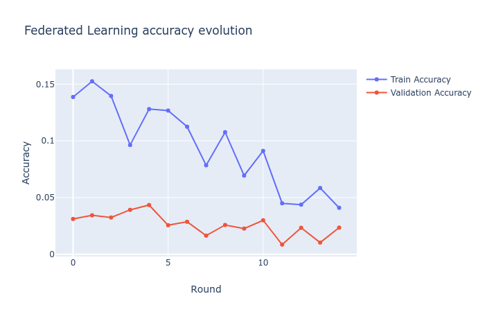

<h1 align="center">
  <a href="https://github.com/xieburou17382121704/KeyPredictorPro/">
    
  </a>
</h1>
<p align="center">
  <a href="/README.md">English</a>
  ·
  <a href="/README_ZH.md">简体中文</a>
</p>

## Introduction

KeyPredictorPro is an open-source project designed to intelligently predict and recommend products that users might be interested in by analyzing their keyboard inputs. The project employs federated learning principles, training models locally on user devices to protect user privacy. This means that user data never leaves their device, complying with strict data privacy policies.

Based on the Google AI team's paper "[Federated Learning for Mobile Keyboard Prediction](https://arxiv.org/pdf/1811.03604.pdf)," we have improved upon this method. By analyzing keyboard inputs, we can predict and recommend products that meet user needs.

The key innovation of this work lies in combining advanced machine learning techniques with privacy protection mechanisms to ensure the security of user data. Training occurs on-device, using locally cached data to train predictive models, achieving personalized product recommendations while safeguarding user privacy.

## Features

- **Intelligent Product Recommendations**: Uses machine learning algorithms to analyze input data and recommend related products.
- **Personalized Predictions**: Provides personalized recommendations based on user behavior data.
- **Data Privacy**: Emphasizes the security and privacy of user data.
- **Modular Design**: Offers extensible code modules for integration into various systems.

### Dataset

KeyPredictorPro uses the [Sentiment140 dataset](https://huggingface.co/datasets/stanfordnlp/sentiment140) provided by Alec Go, Richa Bhayani, and Lei Huang, which contains 1,600,000 tweets. We chose Twitter data because it closely resembles the input data from keyboard applications. This assumption is based on the fact that most people use smartphones to communicate with friends and post on social media.

The dataset can be found on:
- [Hugging Face](https://huggingface.co/datasets/stanfordnlp/sentiment140)
- [Kaggle](https://www.kaggle.com/datasets/kazanova/sentiment140)

### Data Preprocessing

The Sentiment140 dataset contains many empty text samples, duplicates, abbreviations, and misspellings, necessitating data preprocessing. All the issues listed above are considered, and stopwords are added to avoid unnecessary words in our vocabulary.

Example of removing stopwords:

```python
from nltk.corpus import stopwords
from nltk.stem import SnowballStemmer

from utils.processors import get_cleaned_text

stop_words = stopwords.words("english")
stemmer = SnowballStemmer("english")
sentence = "the quick-brown-fox jumps over the lazy dog"
cleaned_sentence = get_cleaned_text(
    "the quick-brown-fox jumps over the lazy dog", stop_words, stemmer
)
print(cleaned_sentence)

# output:
# the quick brown fox jump over the lazy dog
```

- **Data Cleaning**: Data cleaning is the first step in preprocessing, involving the removal of invalid characters, redundant information, and Twitter-specific elements (such as emojis, URLs, @usernames, and special characters). These elements contribute minimally to sentiment analysis and may instead interfere with model training.
  
- **Vocabulary Standardization**: Vocabulary standardization includes stemming and stop word removal. Due to the use of abbreviations, slang, and misspellings by Twitter users, stemming and lemmatization techniques are used to reduce words to their base form. Common stop words like "the," "is," and "and" are removed from the data as they contribute minimally to sentiment analysis.

- **Text Serialization**: Cleaned and standardized text needs to be converted into fixed-length sequences suitable for model input. While tweets are limited in character length, a fixed length is selected for uniform model input by padding or truncating to ensure all tweets reach this length. This allows the data to be fed into the model for training.

- **Data Sorting**: Data needs to be sorted based on timestamps to capture language trends and patterns. This is based on the trend of language development over time, where earlier language patterns may influence subsequent language use. Maintaining the chronological order of data helps improve the efficiency of the model in learning specific vocabulary trends.

## Model Selection and Training

We utilized the [GoogleNews-vectors-negative300](https://code.google.com/archive/p/word2vec/) pre-trained word vectors. By using these pre-trained word vectors, the training process can focus on optimizing the neural network, while keeping the word vectors unchanged during training on the server-side and client-side.

### Model Architecture

We adopted a Bidirectional Long Short-Term Memory (Bi-LSTM) network as the core model architecture, specialized in sentiment analysis tasks. Bi-LSTM, a type of recursive neural network, can capture dependencies in long sequences. By utilizing forward and backward information propagation, Bi-LSTM captures contextual information in input sequences.

The detailed components of the model architecture include:

- **Embedding Layer**: The embedding layer maps discrete word tokens to continuous word vector space. We used the GoogleNews-vectors-negative300 pre-trained word vectors to leverage semantic information and enhance model performance.

- **Bidirectional LSTM Layer**: This layer captures contextual information in input sequences. The forward LSTM captures preceding information, while the backward LSTM captures succeeding information. By combining these two directions, the model can consider both preceding and succeeding context of a word.

- **Dropout Layer**: Dropout is a regularization technique that randomly drops some neuron outputs during training to prevent overfitting.

- **Fully Connected Layer**: This layer maps the output of the LSTM layer to the final prediction. We used the softmax activation function to interpret the model output as probabilities.

The training process follows a pre-training and fine-tuning strategy. Pre-training occurs on the server-side, while fine-tuning is completed on the client-side. Pre-training allows the model to learn general language patterns, while fine-tuning helps the model adapt to specific tasks.

Model performance is evaluated through cross-validation to provide an unbiased estimate of the model's performance on unseen data and prevent overfitting.

### Training Strategy

We adopted a federated learning training mode. Client mobile devices train directly on local data without uploading data to servers, ensuring user privacy. After training, clients send essential model parameter updates and weights to the server for aggregation.

The server aggregates and merges weights from numerous clients to create and improve the global model. User privacy data remains on devices, ensuring data security.

- **Performance Evaluation**: Model performance is evaluated through cross-validation.


### Model Prediction
```python
from nltk.corpus import stopwords
from nltk.stem import SnowballStemmer

import torch as th

from utils.models import bidirectional_LSTM
from utils.processors import get_cleaned_text, print_product_recommendations

# Stopwords and stemmer


stop_words = stopwords.words("english")
stemmer = SnowballStemmer("english")

# Model parameters


context_size = 5
D = 300
word2idx = ...  # Dictionary mapping words to indices
hidden_nodes = 128
local_model = "local_model.pth"  # Local pre-trained model file

# Initialize and load model


model = bidirectional_LSTM(context_size, len(word2idx), D, word2idx, hidden_nodes)
model.load_state_dict(th.load(local_model))

# Example sentence


sentence_example = "i have a colossal headache. it feels like a nuclear weapon testing facility in there"
cleaned_sentence = get_cleaned_text(sentence_example, stop_words, stemmer).split()
print(" ".join(cleaned_sentence))

# Print product recommendations


print_product_recommendations(cleaned_sentence, model)

```
```console
'colossal headache feels like nuclear weapon testing facility'
Previous input: colossal          Recommended products: pain reliever, migraine patch, stress ball
Previous input: headache          Recommended products: headache balm, cooling pad, relaxation tea
Previous input: feels             Recommended products: comfort pillow, ergonomic chair, soothing lotion
Previous input: nuclear           Recommended products: energy drink, focus supplement, productivity app
Previous input: weapon            Recommended products: self-defense class, safety alarm, security camera
```
## Federated Prediction Results

Top-1 Federated Learning Accuracy | Top-3 Federated Learning Accuracy
:-------------------------------:|:-------------------------------:
      | 

The results demonstrate that the KeyPredictorPro project has successfully achieved intelligent prediction and recommendation of products that users may find interesting. By incorporating federated learning, the project effectively safeguards user privacy. This innovation combines advanced machine learning techniques with privacy protection mechanisms, ensuring both the security of user data and personalized recommendations. The project showcases how valuable product recommendations can be provided to users without compromising privacy.

## Directory Structure
```
The KeyPredictorPro directory structure is as follows:
.  
├── data                                          # Datasets and sample data
│   └── GoogleNews-vectors-negative300.bin        # Google News pre-trained word vectors
│   └── pandas_df.pkl                             # Serialized data frame object
│   └── tokenizer_keys.pkl                        # Vocabulary and tokenizer
│   └── training.1600000.processed.noemoticon.csv # Twitter Sentiment140 dataset
├── federated                                     # Federated learning related
│   └── federated_training.py                     # Client training
├── local                                         # Local training related
│   └── local_training.py                         # Local training script
├── models                                        # Machine learning models
│   └── bidirectional_lstm.py                     # Bidirectional LSTM model definition
├── scripts                                       # Script files
├── utils                                         # Utility functions
│   └── constants.py                              # Constant definitions
│   └── data_processors.py                        # Data processing functions
├── main.py                                       # Main program entry
├── README.md                                     # Project overview
└── requirements.txt                              # List of dependencies
```

## Usage Instructions
### ①Environment Setup
Ensure that your environment meets the following requirements:
- **Python**: 3.7.3

```bash
git clone https://github.com/xieburou17382121704/KeyPredictorPro.git
cd KeyPredictorPro
pip install -r requirements.txt
```

### ②Download Datasets

To obtain the datasets required for the project, follow these steps:

1. **Download the Sentiment140 dataset:**

   - Visit the [Kaggle Sentiment140 dataset page](https://www.kaggle.com/datasets/kazanova/sentiment140).
   - Log in or register for a Kaggle account.
   - Find the "Download" button on the page and click to download the dataset.
   - Unzip the downloaded file and place it in the data directory of the project.

2. **Download the GoogleNews-vectors-negative300 word vectors:**

   - Visit the [Google Code Archive](https://code.google.com/archive/p/word2vec/).
   - Locate the `GoogleNews-vectors-negative300.bin.gz` file.
   - Download and unzip the file, then move `GoogleNews-vectors-negative300.bin`  to the `data` directory of the project.

Ensure that all data files are placed in the correct directories so that the project can read and utilize them correctly.

### ③ Running
```shell
python main.py
```
## Academic Insights

KeyPredictorPro is built upon the principles of federated learning, enhancing user privacy through a decentralized training process. This methodology aligns with the latest advancements in privacy-preserving machine learning research, as discussed in the paper "[Federated Learning: Collaborative Machine Learning without Centralized Training Data](https://research.google/blog/federated-learning-collaborative-machine-learning-without-centralized-training-data/)".

The project leverages pre-trained word embeddings from GoogleNews-vectors-negative300, enabling the model to harness semantic understanding of words without the need for retraining word embeddings. This approach is substantiated by research findings, demonstrating that pre-trained word embeddings can significantly enhance model performance (Mikolov et al., 2013).

## License

KeyPredictorPro is released under the MIT License. For details, please refer to the [LICENSE](./LICENSE) file.
