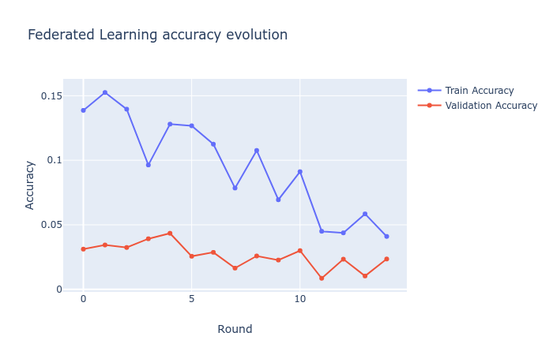
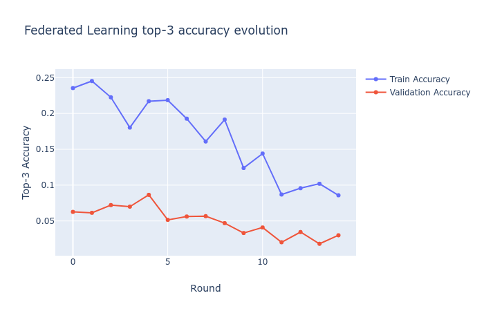

<h1 align="center">
  <a href="https://github.com/xieburou17382121704/KeyPredictorPro/">
    
  </a>
</h1>
  <p align="center">
    <a href="/README.md">English </a>
    ·
    <a href="/README_ZH.md">简体中文</a>
  </p>

## 简介
KeyPredictorPro是一个开源项目，旨在通过分析用户的键盘输入，智能预测和推荐用户可能感兴趣的产品。项目采用了联邦学习的原理，在用户设备本地进行模型训练，以保护用户隐私。这意味着用户的数据不会离开其设备，符合严格的数据隐私政策。

在Google AI团队的论文《[移动键盘预测的联合学习](https://arxiv.org/pdf/1811.03604.pdf)》的基础上，我们对该方法进行了改进。通过分析用户的键盘输入，我们能够预测和推荐用户可能感兴趣的产品，从而满足他们的需求。

这项工作的关键创新点在于结合了先进的机器学习技术和隐私保护机制，确保用户数据的安全性。训练过程在设备端进行，利用本地缓存的数据来训练预测模型，从而实现个性化的产品推荐，同时保护用户隐私。
## 特性

- **智能产品推荐**：使用机器学习算法，分析输入数据并推荐相关产品。
- **个性化预测**：基于用户行为数据，提供个性化的推荐。
- **数据隐私**：重视用户数据的安全和隐私保护。
- **模块化设计**：提供可扩展的代码模块，以便集成到不同的系统中。

### 数据集
KeyPredictorPro 使用了来自 Alec Go、Richa Bhayani 和 Lei Huang 提供的 [Sentiment140 数据集](https://huggingface.co/datasets/stanfordnlp/sentiment140)，其中包含 1,600,000 条推文。我们选择使用 Twitter 数据，因为它与键盘程序用户的输入数据非常相似。这一假设基于大多数人使用智能手机与朋友交流和在社交媒体上发帖的事实。
数据集可以在以下平台找到：
- [Hugging Face](https://huggingface.co/datasets/stanfordnlp/sentiment140)
- [Kaggle](https://www.kaggle.com/datasets/kazanova/sentiment140)
### 数据预处理
由于我们使用的 sentiment140 数据集包含许多空文本样本、重复、缩写、拼写错误等实例，因此需要进行数据预处理。上面列出的所有问题都会被考虑在内，并且还添加了停用词，以避免在我们的词汇表中添加任何不必要的词。

去除提用词示例：
```python
from nltk.corpus import stopwords
from nltk.stem import SnowballStemmer

from utils.processors import get_cleaned_text

stop_words = stopwords.words("english")
stemmer = SnowballStemmer("english")
sentence = "the quick-brown-fox jumps over the lazy dog"
cleaned_sentence = get_cleaned_text(
    "the quick-brown-fox jumps over the lazy dog", stop_words, stemmer
)
print(cleaned_sentence)

# output：
# the quick brown fox jump over the lazy dog
```
- **数据清洗**：数据清洗是预处理的第一步，它涉及去除无效字符、冗余信息以及推特特有的元素（如表情符号、URL、@用户名和特殊字符）。这些元素对情感分析的贡献微乎其微，反而可能干扰模型的训练。
- **词汇标准化**：词汇标准化包括词干提取和去除停用词。由于推特用户常使用缩写、俚语和错别字，词干提取和词形还原技术被用来将词汇还原到其基本形式。同时，常见的停用词，如“the”、“is”、“and”等，由于对情感分析贡献有限，被从数据中移除。
- **文本序列化**：清洗和标准化后的文本需要转化为适合模型输入的固定长度序列。推特的长度在字符数上有限制，因此大部分推特的长度都较短。但是，为了统一模型的输入，选取固定长度，通过填充或截断来使所有推特都达到这个长度。这样，数据就可以送入模型进行训练了。
- **数据排序**：为了捕捉语言使用的趋势和模式，数据需要按照其时间戳进行排序。这是基于语言随时间的发展趋势，即先出现的语言模式可能会影响后续的语言使用。保持数据的时间顺序，有助于提高模型在学习特定词汇趋势时的效率。

### 模型选择和训练
我们使用了 Google 提供的 [GoogleNews-vectors-negative300](https://code.google.com/archive/p/word2vec/) 预训练词向量。通过使用这些预训练的词向量，训练过程能够专注于神经网络的优化，而在服务器端和用户端训练期间保持词向量不变。

### 模型架构

采用双向长短期记忆网络（Bi-directional Long Short-Term Memory, Bi-LSTM）作为核心模型架构，专门处理情感分析任务。Bi-LSTM 作为一种特殊的递归神经网络，能够在长序列中捕获依赖关系。Bi-LSTM 利用正向和反向的信息传播，捕获输入序列中的上下文信息。

模型架构的详细组成如下：

- **Embedding 层**：Embedding 层将离散的词汇标识映射到连续的词向量空间中。本项目采用 Google 的 [GoogleNews-vectors-negative300](https://code.google.com/archive/p/word2vec/) 预训练词向量，使模型能够利用预训练词向量中的语义信息，提高模型的性能。

- **双向 LSTM 层**：双向 LSTM 层捕获输入序列中的上下文信息。正向 LSTM 捕获前文信息，反向 LSTM 捕获后文信息。这两个方向的信息被合并，使模型能够同时考虑到一个词的前文和后文。

- **Dropout 层**：Dropout 层是一种正则化技术，通过在训练过程中随机丢弃一部分神经元的输出，可以防止模型过拟合。

- **全连接层**：全连接层将 LSTM 层的输出映射到最终的预测结果。本项目采用 softmax 激活函数，使模型的输出可以解释为概率。

模型的训练过程采用预训练和微调的策略。预训练在服务器端进行，微调在客户端完成。预训练使模型学习一般的语言模式，微调使模型适应特定的任务。

模型的性能通过交叉验证进行评估。交叉验证提供对模型在未见过的数据上的性能的无偏估计，从而避免模型过拟合。
### 训练策略
采用联合学习的训练模式。客户端移动设备直接在本地数据上进行训练，无需将数据上传到服务器，从而保护用户隐私。训练后，客户端将模型更新的重要参数和权重发送给服务器进行汇总。

服务器对来自大量客户端的权重进行汇总和合并，以创建和改进全局模型。用户的隐私数据始终保留在设备上，确保数据安全。

- **性能评估**：通过交叉验证评估模型性能。

### 模型预测
```python
from nltk.corpus import stopwords
from nltk.stem import SnowballStemmer

import torch as th

from utils.models import bidirectional_LSTM
from utils.processors import get_cleaned_text, print_product_recommendations

# Stopwords and stemmer


stop_words = stopwords.words("english")
stemmer = SnowballStemmer("english")

# Model parameters


context_size = 5
D = 300
word2idx = ...  # Dictionary mapping words to indices
hidden_nodes = 128
local_model = "local_model.pth"  # Local pre-trained model file

# Initialize and load model


model = bidirectional_LSTM(context_size, len(word2idx), D, word2idx, hidden_nodes)
model.load_state_dict(th.load(local_model))

# Example sentence


sentence_example = "i have a colossal headache. it feels like a nuclear weapon testing facility in there"
cleaned_sentence = get_cleaned_text(sentence_example, stop_words, stemmer).split()
print(" ".join(cleaned_sentence))

# Print product recommendations


print_product_recommendations(cleaned_sentence, model)

```
```console
'colossal headache feels like nuclear weapon testing facility'
Previous input: colossal          Recommended products: pain reliever, migraine patch, stress ball
Previous input: headache          Recommended products: headache balm, cooling pad, relaxation tea
Previous input: feels             Recommended products: comfort pillow, ergonomic chair, soothing lotion
Previous input: nuclear           Recommended products: energy drink, focus supplement, productivity app
Previous input: weapon            Recommended products: self-defense class, safety alarm, security camera
```
## 联邦预测结果

Top-1 联邦学习准确率      |  Top-3 联邦学习准确率
:-------------------------:|:-------------------------:
  |  

结果表明，KeyPredictorPro 项目成功实现了智能预测和推荐用户可能感兴趣的产品。在应用联邦学习的同时，项目有效保护了用户隐私。这一创新结合了先进的机器学习技术和隐私保护机制，使得用户数据安全性和推荐的个性化得以保障。项目展示了如何在不牺牲隐私的情况下，为用户提供有价值的产品推荐。


## 目录结构
```
KeyPredictorPro目录结构如下所示：
.  
├── data                                          # 数据集和样本数据
│   └── GoogleNews-vectors-negative300.bin        # Google News 预训练词向量
│   └── pandas_df.pkl                             # 序列化的数据帧对象
│   └── tokenizer_keys.pkl                         # 词汇表和标记器
│   └── training.1600000.processed.noemoticon.csv # Twitter Sentiment140 数据集
├── federated                                     # 联邦学习相关
│   └── federated_training.py                     # 客户端训练
├── local                                         # 客户端训练相关
│   └── local_training.py                         # 本地训练脚本
├── models                                        # 机器学习模型
│   └── bidirectional_lstm.py                     # 双向 LSTM 模型定义
├── scripts                                       # 脚本文件
├── utils                                         # 工具函数
│   └── constants.py                              # 常量定义
│   └── data_processors.py                        # 数据处理函数
├── main.py                                       # 主程序入口
├── README.md                                     # 项目说明
└── requirements.txt                              # 依赖包列表
```

## 使用说明
### ①环境安装
请确保您的环境满足以下要求：
- **Python**: 3.7.3

```bash
git clone https://github.com/xieburou17382121704/KeyPredictorPro.git
cd KeyPredictorPro
pip install -r requirements.txt
```

### ②下载数据集

要获取项目所需的数据集，请按照以下步骤操作：

1. **下载 Sentiment140 数据集：**

   - 前往 [Kaggle Sentiment140 数据集页面](https://www.kaggle.com/datasets/kazanova/sentiment140)。
   - 登录或注册 Kaggle 账户。
   - 在页面中找到 "Download" 按钮，点击下载数据集。
   - 将下载的文件解压到项目的 `data` 目录下。

2. **下载 GoogleNews-vectors-negative300词向量：**

   - 前往 [Google Code Archive](https://code.google.com/archive/p/word2vec/)。
   - 找到 `GoogleNews-vectors-negative300.bin.gz` 文件。
   - 下载并解压文件，将 `GoogleNews-vectors-negative300.bin` 移动到项目的 `data` 目录下。

确保所有数据文件都放置在正确的目录中，以便项目能够正确读取和使用它们。

### ③运行
```shell
python main.py
```

## 学术见解

KeyPredictorPro 基于联邦学习的原理，通过去中心化的训练过程来增强用户隐私。这种方法符合最新的隐私保护机器学习研究，如论文 《[联邦学习：无需集中训练数据的协作机器学习](https://research.google/blog/federated-learning-collaborative-machine-learning-without-centralized-training-data/) 》中所述。

项目使用了 GoogleNews-vectors-negative300 的预训练词向量，使模型能够在不重新训练词向量的情况下利用词语的语义理解。这种方法得到了研究的支持，表明预训练的词向量可以显著提高模型性能（Mikolov 等人，2013）。
## 许可证

KeyPredictorPro 是在 MIT 许可证下发布的。详情请参阅 [LICENSE](./LICENSE) 文件。

